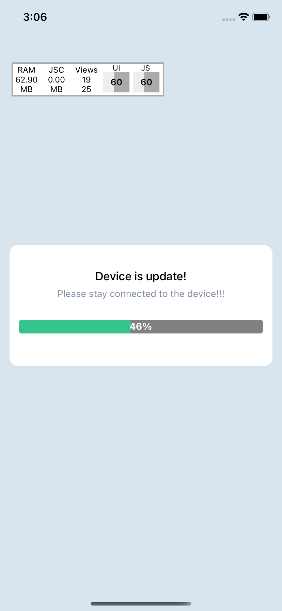

# Modal Progressbar Js Code - Support Android and IOS
- 60FPS
- js Code

## Installation

- Step 1:
  first you can install lib "react-native-modal":

```sh
yarn add react-native-modal
```

- Step 2:

```sh
yarn add react-native-modal-progress-bar
```

## Usage

```js
import React, { useEffect, useState } from 'react';
import { StyleSheet, Text, TouchableOpacity, View } from 'react-native';
import ModalProcess from 'react-native-modal-progress-bar';
import useInterval from './useInterval';

const App = () => {
  const [percent, setPercent] = useState<number>(0);
  const [isShowModal, setShowModal] = useState<boolean>(false);

  const onAddPercent = () => {
    setPercent(percent + 2);
  };

  useEffect(() => {
    if (percent > 0 && isShowModal === false) {
      setShowModal(true);
    }
  }, [percent]);

  useInterval(() => {
    onAddPercent();
  }, percent > 0 && percent < 100 ? 2000 : null);

  return (
    <View style={{ justifyContent: 'center', flex: 1, marginHorizontal: 14 }}>
      <Text>
        Hello
      </Text>
      <TouchableOpacity style={styles.btn} onPress={onAddPercent}>
        <Text style={styles.txtWhite}>Add percent</Text>
      </TouchableOpacity>

      <ModalProcess
        isVisible={isShowModal}
        percent={percent}
        hiddenModal={() => setShowModal(false)}
        title={'Device is update!'}
        subTitle={'Please stay connected to the device!!!'} />

    </View>
  );
};

const styles = StyleSheet.create({
  btn: {
    backgroundColor: 'brown',
    justifyContent: 'center',
    paddingVertical: 12,
    alignItems: 'center',
    width: '60%',
    alignSelf: 'center',
    marginVertical: 20,
    borderRadius: 11,
  },
  txtWhite: { color: 'white', fontWeight: 'bold' },

});

export default App;

```

### Properties

```typescript

interface ModalProcessProps {
  wrapProcess: ViewStyle;
  onBackdropPress?: () => void;
  subTitleStyle?: TextStyle;
  styleTitle?: TextStyle;
  styleModal?: ViewStyle;
  hiddenModal?: () => void;
  isVisible: boolean;
  setVisible?: (isShowModal: boolean) => void;
  percent: number;
  heightProgressbar?: number;
  colorBg?: string;
  colorProcess?: string;
  backgroundColorModal?: string;
  backdropColor?: string;
  title: string;
  subTitle?: string;
  propsModal?: ModalProps;
  styleWrapContentModal?: ViewStyle;
}

declare const ModalProcess: (props: ModalProcessProps) => JSX.Element;
export default ModalProcess;

```

### Demo




## License

MIT
